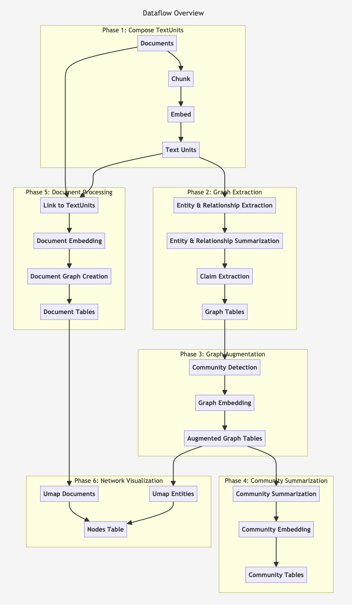

# GraphRAG Setup and Usage Guide

## Interesting Links

* Full Documentation: [here](https://microsoft.github.io/graphrag/posts/index/1-default_dataflow/)
* For Graph Visualization: [here](https://github.com/microsoft/graphrag/blob/main/examples_notebooks/community_contrib/yfiles-jupyter-graphs/graph-visualization.ipynb), [github issue](https://github.com/microsoft/graphrag/issues/340)
* Upload .parquet files [here](https://noworneverev.github.io/graphrag-visualizer/) for incredible grapg visualization

```
snapshots:
	graphml: True
```



## Pre-requirements:

Python latest version is giving some errors in installing Gensim and another library, so I recommend you to consider python 3.10 version.

### Steps:

1. **Open VSCode > Terminal (command prompt) and continue the below commands:**

   ```sh
   # Create a new directory
   mkdir Graphrag

   # Create a new conda environment with Python 3.10
   conda create -p ./graphragvenv python=3.10

   # Activate the created conda environment
   conda activate ./graphragvenv

   # Install and update pip
   python -m pip install --upgrade pip

   # Install and upgrade the setuptools package
   python -m pip install --upgrade setuptools
   ```
2. **Install GraphRAG:**

   ```sh
   # Install GraphRAG
   pip install graphrag

   # If installing GraphRAG raises any error, run the below command
   python -m pip install --no-cache-dir --force-reinstall gensim

   # Then install GraphRAG again
   pip install graphrag
   ```
3. **Initialize GraphRAG:**

   ```sh
   python -m graphrag.index --init --root .
   ```
   Running the above command, GraphRAG is initiated and creates folders and files.
4. **Creating the Deployments of LLM Model and Embedding Model in Azure OpenAI:**

   - For embedding, the model is `text-embedding-small`
   - For LLM model, recommended is `GPT-4o`.

   > I have tried with `GPT-35-turbo-instruct` which is not working, raising some issues on creating the graphs at the end. I recommend you to use `GPT-4o`, and the model is very good at providing accurate answers. You can also check which other models
   >

   After creating the deployments, you need to make some changes in the `settings.yaml` file.
5. **Configure OPENAI_API_KEY:**

   `.env` is also created when you initialize GraphRAG, you can configure your `OPENAI_API_KEY` there.
6. **Make Changes in `settings.yaml` File:**

   Go to the `llm` section:

   - Change the `api_key` from `${GRAPHRAG_API_KEY}` to `${OPENAI_API_KEY}`
   - Change `type` from `openai_chat` to `azure_openai_chat`
   - Change `model` to the model name that you deployed in Azure OpenAI.
     - In my case, I have taken `GPT-4o`, you can try with other models as well.
   - Uncomment the `api_base` and replace that URL with the endpoint of the Azure OpenAI
     - In my case `<your_azure_openai_resource_group_name>` is used, you can give any name to the instance.
   - Uncomment the `api_version`, no need to make changes in that, you can use the default `api_version`
   - Uncomment the `deployement_name`, and replace that with the deployment you have given to the model while creating the deployment.
     - In my case, I have taken `<deployment_name_of_model>`

   In the same `settings.yaml` file, go to the `embeddings` section and make some changes:

   - Change the `api_key` from `${GRAPHRAG_API_KEY}` to `${OPENAI_API_KEY}`
   - Change `type` from `openai_embeddings` to `azure_openai_embeddings`
   - Change `model` to the model name that you deployed in Azure OpenAI.
     - In my case, I have taken `text-embedding-small`, you can try with other models as well.
   - Uncomment the `api_base` and replace that URL with the endpoint of the Azure OpenAI
     - In my case `<your_azure_openai_resource_group_name>` is used, you can give any name to the instance.
   - `api_version`, you can comment that or you can uncomment and use that. It won't raise an error
   - Uncomment the `deployement_name`, and replace that with the deployment you have given to the model while creating the deployment.
     - In my case, I have taken `<deployment_name_of_model>`

   That's it. Now save the changes that you made in the `settings.yaml` file.
7. **Add Input File:**

   You need to add an input text file, to do that first create a folder by running the below command:

   ```sh
   mkdir input
   ```
   Now in this `input` folder, you need to add the `.txt` file (input text data file).
8. **Run GraphRAG to Create Graphs on the Data:**

   ```sh
   python -m graphrag.index --root .
   ```
   This command will run the GraphRAG and create the parquet files. This will convert all your text data into entities and relationships graphs. You can check that in `output > last folder > artifacts folder` (you have parquet files, which are converted data into graphs).
9. **Evaluate Our RAG Model:**

   Now we need to test our RAG model, to do that we need to ask questions. We are doing things in the command prompt, we need to ask questions to our model along with a command. To ask a question, you need to write a command and then the question:

   ```sh
   python -m graphrag.query --root . --method local/global "Your_Question"
   ```
   When you run this command, the model uses either `local` (if written `local`) or `global` (if written `global`) to answer the question.

   To confirm the model is accurate, we can copy any word from the output of the model and find it in the text file:

   - Copy the word you need to check
   - Go to the text file (input file) and hit `ctrl+f`, a search bar will open
   - Paste that copied word in this search bar, use the arrows to navigate to the words in the text file.
