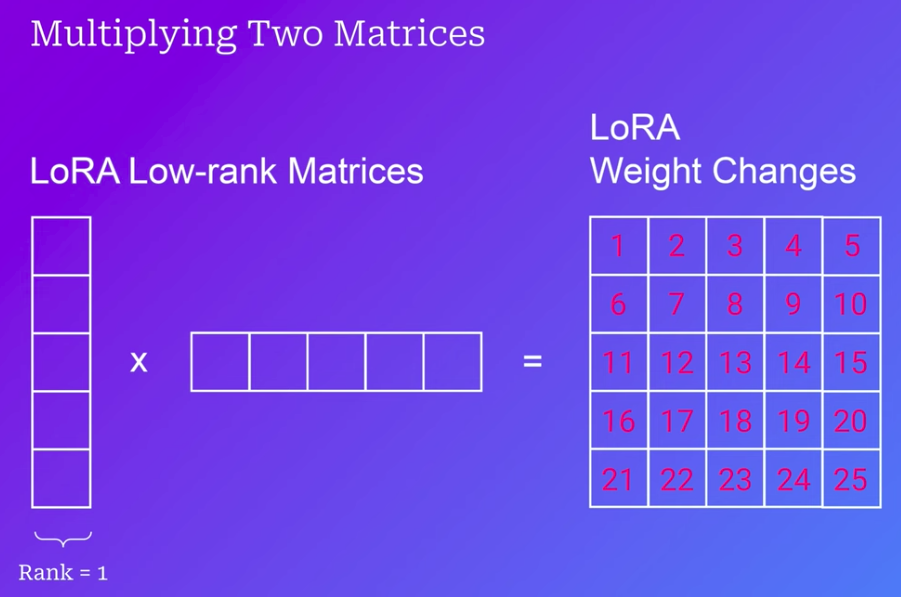
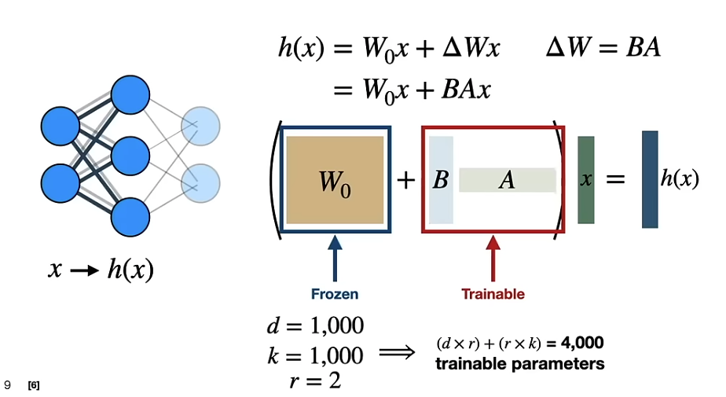
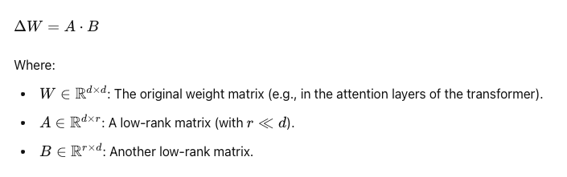

# LLM Fine-tuning

**Topics:**

* **Instruct fine tuning (IFT)**
* Multilingual IFT
* **LoRA (Low Rank Adaptations)**
* QLoRA (Quantized)
* **Direct Preference Optimization (DPO)**
* Distributed Training
* Synthetic Data Generation

## Why Fine-tune?

* [Fine-tuning LLMs](https://www.youtube.com/watch?v=eC6Hd1hFvos&t=32s) | w/ Example Code
* A smaller (fine-tuned) model can outperform a larger base model (at particular use cases)
* Demonstrated by OpenAI when InstructGPT (1.3B) outperformed GPT-3 (175 B)

## 3 Ways to Fine-tune

1) **Self-supervised**

* Generate a curated training corpus with sequences of text. E.g. "Listen to your" + "heart" (completion)
* You can curate your training corpus to align with a certain application or format. Generate completions with a given style

2. **Supervised**

* Training set of Inputs + Outputs (Question, answer pairs)
* Recommended to use Prompt Templates:

```
""" Please answer the followinng question.
Q: {Question}
A: {Answer} """
```

3. **Reinforcement Learning**
   * Typical steps:
     1. Supervised FT
     2. Train Reward Model
     3. RF with PPO (Proximal Policy Optimization): Take the prompt, pass it to the supervised fine-tuned model, and pass the completion to the Reward Model, which will give feedback to the fine-tuned model
   * We also finde **RLHF (Reinforcement learning from human feedback),** which aimss to improve abstract qualities like helpfulness and honesty

### Supervised Fine-Tuning (in 5 Steps)

1. Choose fine-tuninng task
2. Prepare training dataset
   * E.g. Text summarization
3. Choose a base model
4. Fine-tune model via supervised learning
5. Evaluate model performance

### Fine-tune model via supervised learning *(step 4)*

**3 Options for Parameter Training:**

1. **Retrain all parameters:**
   * Probably too expensive (pre-training needss around 3 trillion tokens...)
2. **Transfer Learning**
   * Freeze subset of parameters and fine-tune only the last layers. Cheaper
3. **Parameter Efficient Fine-tuning (PEFT)**
   1. Freeze ALL the weights
   2. Augment the model with additional parameters which are trainable
   3. **Use LoRA (Low-Rank Adaptation)**

## LoRA (Low-Rank Adaptation)

> Fine-tunes the model by adding new trainable parameters

**Links:**

* LoRA & QLoRA Fine-tuning [Explained In-Depth](https://www.youtube.com/watch?v=t1caDsMzWBk)
* Low-rank Adaption of Large Language Models: E[xplaining the Key Concepts Behind LoRA](https://www.youtube.com/watch?v=dA-NhCtrrVE)

**Key Concepts:**

* **How is LoRA different?**

  * Instead of updating weights directly, **we track changes**
  * These weight changes are tracked in **two spearate, smaller matrices** that get multiplied together to form a matrix the same size as the model's weight matrix
  * We sacrifice **some precision** in the final matrix at exchange of huge optimization (cost saving)
* We can decide the **RANK** we are using to fine tune if LoRA (rank 1, 2, 8, 16...)

  * The higher the rank, the higher the precision, the higher the amount of parameters we need to train
* With LoRA, we are still training ALL the model parameters, but by just working with a smaller subset of them
* **Does Rank Really Matter?**

  * The theory is that downstream tasks are intrinsically low-rank

The original pre-trained weights are kept frozen, which means you can have multiple lightweight and portable LoRA models for various downstream tasks built on top of them.





### Core Idea behind LoRA

In standard fine-tuning of LLMs, the full weight matrices of the model are updated to fit a downstream task. LoRA takes a different approach by **assuming that the weight updates during fine-tuning lie in a "low-rank" space**, which means the changes required to adapt the model to a new task can be approximated by a low-rank matrix.

#### Decomposition of Weight Updates

LoRA introduces two trainable low-rank matrices \( A \) and \( B \), which are much smaller than the original weight matrix \( W \). Instead of fine-tuning \( W \) directly, LoRA approximates the weight update using these low-rank matrices:



The idea is that instead of directly updating \( W \), you update the product of the much smaller matrices \( A \) and \( B \). This reduces the number of trainable parameters from `d x d` to `2 x d x r` which is significantly smaller when \( r \) (the rank) is much less than \( d \).

### Why is LoRA Less Precise?

LoRA introduces a **low-rank constraint** on the weight updates. When the rank is small (e.g., 1), it limits the complexity of the updates because the matrix product \(B A\) cannot fully capture all the variability that might be necessary to optimally adapt the model to the data.

In the above example:

- With **regular fine-tuning**, each element of the matrix was independently adjusted, which allows for maximum precision and flexibility.
- With **LoRA**, the updates are structured and restricted by the rank, which results in a simpler, more constrained update. While this can still adapt the model, it may miss out on the fine details that a full update would capture, especially in complex, high-dimensional tasks.

### How LoRA works in Fine-tuning

1.**Freeze Pre-Trained Weights**: In LoRA, the original weight matrix \( W \) in the model remains frozen, i.e., it is not updated during fine-tuning. **Only the newly introduced low-rank matrices \( A \) and \( B \) are updated.**

2.**Inject LoRA into Specific Layers**: LoRA is usually applied to the weight matrices in specific layers, typically the `self-attention layers of transformers`. These layers are computationally expensive, and most of the learning happens here, making them a prime target for optimization.

3.**Adaptation Through Low-Rank Updates**: Instead of updating the full weight matrix, the change in weights is `approximated` by updating the product \( A · B), which is much smaller in size. This keeps the memory footprint small while still allowing the model to adapt to new tasks.

4.**During Inference**: Once the model is fine-tuned with LoRA, the low-rank matrices \( A \) and \( B \) are used to compute the adapted weights by adding \( Delta W = A · B \) to the original weight matrix \( W \).

### Practical example:

> * Check this [guide](https://huggingface.co/docs/peft/main/en/conceptual_guides/lora) from HuggingFace
> * Lora [methods](https://huggingface.co/docs/peft/main/en/task_guides/lora_based_methods) from HuggingFace

1. Create dataset (1000 data points may be enough)
2. Preprocess data
   1. Tokenize (grab tokenizer for the particular base model we are fine-tuning)
   2. Define tokenization function, specific to our dataset
      1. Extract text, tokenize and truncate text
   3. We need to add pad_token. To make all tokens same input length
   4. We can use a Data Collator to be more efficient at padding our dataset
3. Define Evaluation Metrics
   1. Define evaluation function
4. Define our LoRA configuration
5. Define hyperparameters (lr, batch_size, epochs) and training arguments


## [QLoRA](https://arxiv.org/abs/2305.14314): Quanzited LoRA

> QLoRA backpropagates gradients through a frozen, 4-bit quantized pretrained language model into Low Rank Adapters~(LoRA).

* Basically LoRA 2.0
* Uses even less memory with "recoverable" quantization
* Paper has other critical findings:
  * Training all layers of the network is necessary to match performance of full-parameter fine tunning
  * Rank may not matter in the range 8 to 256 (i.e. it does not affect performance)
  * The most critical LoRA hyperparameter is `how many LoRA adapters are used in total = how many layers of the network we are training`

#### Core Concepts of QLoRA

Altough LoRA manages to train LLMs by reducing the number of trainable parameters, the **model's forward passs still consumes a lof of memory.**

1. **Quantization**: Quantization is a technique where the precision of the model weights is reduced to lower bit-widths, typically from 16-bit (FP16) or 32-bit (FP32) to **4-bit** integers (INT4). This drastically reduces memory usage and computational overhead.
2. **Low-Rank Adaptation (LoRA)**: Just like LoRA, QLoRA injects small low-rank matrices into the model to perform updates. The frozen quantized weights (from the 4-bit model) are combined with these low-rank matrices for the fine-tuning process.

**In QLoRA:**

- The **base model is quantized** to 4-bit precision for storage and computation efficiency.
- **Only the low-rank adaptation matrices (LoRA matrices) are updated** during training, while the original model weights stay fixed in their quantized form.

#### Workflow of QLoRA

1. **Quantizing the Model**: Before fine-tuning, the pre-trained LLM is quantized to 4-bit precision, reducing memory usage dramatically. This enables the fine-tuning of much larger models on consumer-grade GPUs.
2. **LoRA Fine-Tuning**: After quantization, QLoRA injects low-rank matrices into the model, similar to the standard LoRA approach. The frozen quantized weights are supplemented by these trainable matrices, which are small in size, making the training process more efficient.
3. **Training**: During training, only the LoRA matrices are updated, while the 4-bit quantized weights remain fixed. This significantly reduces the number of parameters that need to be updated and the memory required for gradients.
4. **Performance**: Despite the aggressive quantization, QLoRA achieves near full-precision performance because only a small number of parameters (the LoRA matrices) are trained with higher precision, and the quantized weights provide a good approximation of the original full-precision model.

**LoRA & QLoRA Hyperparameters**

* `Alpha` determiness the multiplier applied to the weight changes when added to the original weights
  * Scale multiplier = Alpha / Rank
  * Microsoft LoRA repository sets to 2xRank
  * QLoRA went with 1/4 of Rank (alpha = 16, rank = 64) --> kind of surprising
* `Dropout` is a percentage that randomly leaves out some weight changes each time to prevent overfitting (e.g. 0.1 or 0.05)
* Also other typical ones: `LR`, `batch_size`, ...

#### Example of QLoRA in Practice

Let’s take an example where you want to fine-tune a large pre-trained model like LLaMA 65B for a specific NLP task, such as sentiment classification:

1. **Quantization**: First, the entire LLaMA 65B model is quantized to 4-bit precision, significantly reducing its memory footprint (e.g., from over 300GB to around 60GB).
2. **LoRA Injection**: You inject LoRA matrices into specific layers of the model, like the self-attention and feed-forward layers. These matrices are small in size compared to the full model weights.
3. **Fine-Tuning**: You then fine-tune only the LoRA matrices on your specific task. The quantized base model remains frozen during this process, requiring less memory and compute resources.
4. **Inference**: During inference, the model uses the frozen quantized weights along with the fine-tuned LoRA matrices to make predictions, achieving near full-precision accuracy while being very efficient in terms of resource usage.

## Instruct Fine-Tuning (IFT)

*Instruction tuning* is a technique for **[fine-tuning](https://www.ibm.com/topics/fine-tuning) large language models** [(LLMs)](https://www.ibm.com/topics/large-language-models) on a labeled dataset of instructional prompts and corresponding outputs. It improves model performance not only on specific tasks, but on following instructions in general, thus helping adapt pre-trained models for practical use.

> The goal of instruction tuning is to improve the ability of LLMs to respond to NLP instructions.

### Why [instruction tune](https://www.ibm.com/topics/instruction-tuning) LLMs?

* **Problem:** The utility of instruction tuning, like that of most fine-tuning techniques, lies in the fact that pre-trained LLMs are not optimized for conversations or instruction following. In a literal sense, LLMs do not  ***answer* a prompt: they only** *append text to it.* Instruction tuning helps make that appended text more useful.
* **Limitations:** Pre-training an LLM for any specific purpose (like following instructions) is impractical. Since LLMs often have billions of parameters: training these huge models from scratch entails a tremendous amount of energy, time, computational resources and training data.
* **Solution:** IFT entails **[supervised learning](https://www.ibm.com/topics/supervised-learning) on labeled ( *input, output* ) pairs.**

> What distinguishes instruction tuning from other forms of supervised fine-tuning (SFT) is that the *input* samples in an instruction dataset consist entirely of tasks that resemble requests users might make in their prompts; the *outputs* demonstrate desirable responses to those requests.

### How does instruction tuning work?

Each training sample in an instruction dataset comprises three elements:

* **An instruction:** **A natural language text** *input* that specifies a given task. For example, “*translate this sentence from English to Spanish.”*
* **Additional information:** Optional, supplementary information that provides context relevant to the task at hand. For example, an input for a reading comprehension task might include a brief passage (and then instruct the model to answer a given question about it).
* **Desired output:** **The target** *output* —response—for the given prompt, per the instructions and context provided. This will serve as a ground truth against which the model’s predictions are evaluated and optimized.

> Certain [research](https://arxiv.org/abs/2109.01652) has demonstrated that adding additional tasks to the instruction tuning dataset improved the instruction-tuned model’s performance even on novel tasks that were not represented in the instruction dataset. Therein lies the fundamental benefit of instruction tuning: a holistic improvement in the model’s ability to follow instructions in general.

**Why Instruction tuning against multi-task fine-tuning:** [here](https://www.ibm.com/topics/instruction-tuning#Instruction+tuning+vs.+multi-task+fine-tuning)

### Challenges and limitations

* The creation of high-quality instructions for use in fine-tuning.

## How to do IFT on OpenAI GPT models?

* OpenAI Fine-tuning [guide](https://platform.openai.com/docs/guides/fine-tuning)
* Fine-tuning ChatGPT with OpenAI Tutorial - [here](https://www.youtube.com/watch?v=VVKcSf6r3CM)

At a high level, fine-tuning involves the following steps:

1. Prepare and upload training data
2. Train a new fine-tuned model
3. Evaluate results and go back to step 1 if needed
4. Use your fine-tuned model

Some common use cases where fine-tuning can improve results:

* Setting the style, tone, format, or other qualitative aspects
* Improving reliability at producing a desired output
* Correcting failures to follow complex prompts
* Handling many edge cases in specific ways
* Performing a new skill or task that’s hard to articulate in a prompt

**How to prepare the dataset:** [here](https://platform.openai.com/docs/guides/fine-tuning/preparing-your-dataset)

#### **Example count [recommendations](https://platform.openai.com/docs/guides/fine-tuning/example-count-recommendations)**

> To fine-tune a model, you are required to provide at least 10 examples. We typically see clear improvements from fine-tuning on 50 to 100 training examples with **`gpt-4o-mini` and** `gpt-3.5-turbo`, but the right number varies greatly based on the exact use case.

> We recommend starting with 50 well-crafted demonstrations and seeing if the model shows signs of improvement after fine-tuning. In some cases that may be sufficient, but even if the model is not yet production quality, clear improvements are a good sign that providing more data will continue to improve the model. No improvement suggests that you may need to rethink how to set up the task for the model or restructure the data before scaling beyond a limited example set.

#### Iterating on data [quantity](https://platform.openai.com/docs/guides/fine-tuning/iterating-on-data-quantity)

Once you’re satisfied with the quality and distribution of the examples, you can consider scaling up the number of training examples. This tends to help the model learn the task better, especially around possible "edge cases". We expect a similar amount of improvement every time you double the number of training examples. You can loosely estimate the expected quality gain from increasing the training data size by:

* Fine-tuning on your current dataset
* Fine-tuning on half of your current dataset
* Observing the quality gap between the two

In general, if you have to make a trade-off, a smaller amount of high-quality data is generally more effective than a larger amount of low-quality data.

## Multilingual IFT (Instruction Fine Tuning)

#### Zero-shot cross-lingual knowledge transfer in generative tasks: [paper](https://www.aimodels.fyi/papers/arxiv/key-ingredients-effective-zero-shot-cross-lingual)

The paper **"Key Ingredients for Effective Zero-Shot Cross-Lingual Knowledge Transfer in Generative Tasks"** explores how to adapt multilingual pretrained language models (mPLMs) for zero-shot cross-lingual generation tasks, such as summarization and question answering (QA).

**Key Points:**

1. **Zero-Shot Cross-Lingual Transfer**:

   - This approach enables a model trained on a task in one language (usually English) to perform the same task in a different, unseen language. While this has been extensively studied in natural language understanding (NLU), it's less explored for generative tasks like summarization or QA.
2. **Problem of Wrong Language Generation**:

   - A frequent issue in zero-shot cross-lingual generation is that models often generate outputs in the wrong language. Previous work has tried to address this with techniques like freezing model components, using parameter-efficient tuning, or mixing unsupervised data from the target language.
3. **Backbone Models**:

   - The authors compare three models: mT5, mBART, and NLLB-200, across two generative tasks (summarization and QA) to understand which is better suited for zero-shot transfer.
4. **Key Findings**:

   - **Learning Rate Tuning**: Carefully tuning the learning rate substantially reduces the issue of generating in the wrong language.
   - **Full Fine-Tuning**: Simple full fine-tuning of the model provides a strong baseline, often outperforming more complex adaptation techniques.
   - **Model Comparisons**: mBART and mT5 perform similarly, with mBART better suited for long text generation and mT5 for shorter outputs. NLLB-200, surprisingly, performs well for summarization but not as well for QA.
   - **Intermediate Tuning**: Helps improve performance in many cases, particularly for mBART.
5. **Adaptation Methods**:

   - The authors evaluate six methods, including full fine-tuning, prompt tuning, and adapters, and conclude that full fine-tuning is a strong approach when hyperparameters are carefully chosen.
6. **Performance Benchmarks**:

   - Zero-shot models perform comparably to approaches based on data translation (where task data is translated into the target language), which is usually considered the upper bound for performance.

In the paper, the authors tested their approach using two datasets:

1. **XL-Sum** (for news summarization) across **44 languages**, with dataset sizes varying from 1K (Scottish Gaelic) to 300K (English) article-summary pairs. For evaluation, they cropped the test sets to 2K samples per language.
2. **XQuAD** (for question answering), which contains translations of the SQuAD validation set into **11 languages**. The authors used a test set of around 1190 questions, filtering those whose answers contain numbers and ensuring that answers are in the target language.

For XL-Sum, they evaluated summarization with the **ROUGE-2 metric**, and for XQuAD, they used the **F1-score**.

Also, the paper discusses that **zero-shot transfer performance varies depending on the language**. Specifically:

- For **summarization** (XL-Sum), the **performance varies significantly** across languages. High-resource, Latin-script languages like **French** and **Spanish** perform better, while languages like **Chinese** pose challenges, such as **empty predictions** from NLLB-200. This model was noted to have processing issues with Chinese.
- In **question answering** (XQuAD), **NLLB-200** also struggled, producing **non-relevant answers** more frequently in certain languages. Latin-script, high-resource languages (e.g., **French**, **Spanish**) saw better performance with mT5 and mBART, but overall, **QA performance lagged** in low-resource languages.

The paper highlights that performance can be linked to:

- Language script (Latin vs. non-Latin).
- Resource availability for the language.

For example, **NLLB-200** performed **well for summarization in Latin-script languages**, but its results dropped in Chinese and other non-Latin scripts

https://www.aimodels.fyi/papers/arxiv/sphinx-sample-efficient-multilingual-instruction-fine-tuning

#### Zero-shot cross-lingual transfer in instruction tuning of large language models: [paper](https://www.aimodels.fyi/papers/arxiv/zero-shot-cross-lingual-transfer-instruction-tuning)

The more recent paper introduces a systematic study of **zero-shot cross-lingual transfer in instruction tuning** of large language models (LLMs). Specifically, the key new aspects introduced in this paper compared to prior works include:

1. **Zero-Shot Cross-Lingual Transfer for Instruction Tuning**:

   - The focus is on instruction-tuning LLMs **only on English data** and testing their performance when prompted in other languages. This study evaluates the models’ ability to follow instructions in languages that were not part of the training data.
2. **Evaluation of Different Aspects of Model Responses**:

   - The paper emphasizes the importance of assessing various aspects of multilingual instruction-following, such as:
     - **Language correctness** (whether the model responds in the correct language)
     - **Helpfulness**
     - **Fluency**
     - **Factual accuracy**
     - **Logical coherence**
     - **Harmlessness**

   The paper argues that high-level evaluations alone are insufficient, and a deeper breakdown of these facets is essential for open-ended generation tasks in multiple languages
3. **Findings on Model Configuration and Data Size**:

   - The paper explores the impact of model size, data size, adaptation strategies (like full fine-tuning vs. LoRA), and hyperparameter tuning on cross-lingual performance.
   - It finds that **cross-lingual transfer works even when models are English-centric**, but multilinguality in tuning hyperparameters and using a large instruction-tuning dataset is crucial
4. **Challenges with Non-English Factuality**:

   - One of the main limitations is that factuality in non-English languages remains lower, although models can still produce fluent and helpful responses in other languages

In contrast to prior research, this paper does a **deep dive into zero-shot cross-lingual instruction tuning**, focusing on how English-only training can impact performance across different languages and tasks without requiring additional language-specific training data.

**Datasets:**

The paper evaluates the **cross-lingual transfer** performance using two main datasets:

1. **Dolly (Databricks, 2023)**:

   - **English-only instruction dataset**: 15k crowdsourced instructions across 7 categories, including creative writing, open/close QA, classification, and information extraction.
   - **Multilingual Dolly (Dolly-DT)**: This is an extended version of Dolly, automatically translated into **French, Portuguese**, and **Russian** using NLLB-3.3B.
2. **LIMA (Zhou et al., 2023)**:

   - A highly curated English dataset containing **1,000** instruction-response pairs selected from sources like StackExchange and WikiHow, designed for high-quality instruction tuning

**Languages Tested:**

- **English**
- **French**
- **Portuguese**
- **Russian**

Instructions from the datasets are translated into these languages using Google Translate and manually corrected by native or fluent speakers

#### Quantifying Multilingual Performance of Large Language Models Across Languages: [paper](https://arxiv.org/pdf/2404.11553)

The paper introduces the **Language Ranker**, a novel metric designed to measure the performance of Large Language Models (LLMs) in both high-resource and low-resource languages. The study addresses the performance disparity in LLMs, where models trained predominantly on high-resource languages (e.g., English, German) perform significantly worse on low-resource languages.

**Key Contributions:**

1. **Language Ranker Metric**:

   - The authors propose an **intrinsic metric** based on the **cosine similarity** of internal representations between English and other languages. By comparing the representation of different languages against English, the Language Ranker assesses the model's multilingual capabilities.
2. **Correlation with Training Data**:

   - The paper shows that the **performance of LLMs** in various languages is **strongly correlated with the amount of training data** in those languages. High-resource languages with more representation in the training data exhibit better performance.
3. **Embedding Space Analysis**:

   - The study also analyzes the **embedding space** of LLMs and demonstrates that **high-resource languages** tend to be more evenly distributed, while **low-resource languages** are clustered, which impacts model performance.

**Datasets Used:**

The authors use the **OPUS-100** dataset, an English-centric multilingual corpus covering **100 languages**. After filtering, the authors evaluate **94 languages**, including both high-resource (e.g., German, French) and low-resource (e.g., Oriya, Kazakh, Kannada). Each language subset contains **2,000 samples**

**Performance in Different Languages:**

- The authors find that **high-resource languages**, such as **German, Spanish, and French**, show higher similarity scores to English, indicating better performance.
- **Low-resource languages** like **Igbo, Kazakh, and Turkmen** show lower similarity scores, highlighting the challenges of cross-lingual performance in these languages

#### Multilingual Instruction Tuning With Just a Pinch of Multilinguality: [paper](https://arxiv.org/pdf/2401.01854)

- **Effect of Multilinguality in Instruction Tuning**: The study explores how adding multilingual examples during instruction tuning impacts instruction-following in different languages present in the model’s pre-training data.
- **Monolingual Tuning Effect**: Monolingually tuned models can still transfer some instruction-following abilities to other languages.
- **Small Multilingual Examples Help**: Including just **40 multilingual examples** in an English-tuned dataset can significantly enhance instruction-following in both seen and unseen languages during tuning.
- **Efficiency of Multilingual Tuning**: Models trained on multilingual datasets perform comparably or even better across languages than monolingually tuned models, even when trained on **10x fewer examples** in those languages.
- **Diversifying Training Languages**: Including just **2-4 languages** in the instruction tuning set improves cross-lingual generalization.
- **Key Insight**: Building **massively multilingual instruction-tuned models** can be achieved using a **small set of multilingual instruction-response pairs**.
