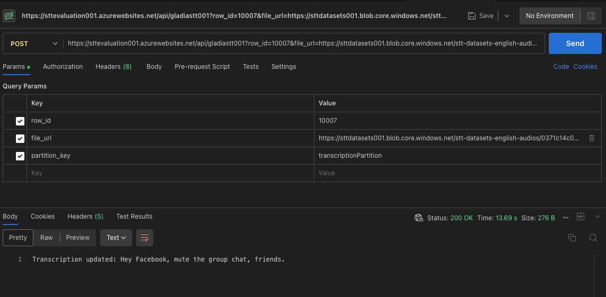

# STT Evaluation Framework Guide

### 0. Setup [configuration.py](configuration.py) file

```
subscription_id = os.getenv("AZURE_SUBSCRIPTION_ID")  # Your Azure subscription ID
resource_group_name = "stt_evaluation"  # Replace with your desired resource group name
location = "eastus"  # Azure region for the resource group and storage account
storage_account_name = "sttdatasets001"  # Replace with your desired storage account name

# CONTAINERS
container_name_gt = "stt-datasets-gt"  # Replace with your container name
container_name_english_audios = "stt-datasets-english-audios"  # Replace with your container name

# LOCAL FOLDERS / PATHS
local_tsv_folder = "stt_datasets/gt"  # Local folder containing .tsv files
local_wav_folder = "stt_datasets/audios/english"  # Local folder containing .wav files

# AZURE TABLES
table_name_english = "EnglishTranscriptions"  # Name of your table

# AZURE FUNCTION
app_service_plan_name = "sttevaluationplan"
function_app_name = "sttevaluation001"
function_name_gladiastt = "gladiastt001"
runtime = "python"  # Runtime can be 'python', 'node', etc.
python_version = "Python|3.10"
```

### 1. Create Azure Resources.

* Run [01_azure_resources_creation.py](01_azure_resources_creation.py)

Running this script will create a new **resource group** with a **storage account**, following the namings established in [configuration.py](configuration.py)

### 2. Upload STT Datasets

* Run [02_upload_stt_datasets.py](02_upload_stt_datasets.py)

Running this script will:

1. Upload .tsv files containing the list of **{transcription, audio_file} ground truth** for each language to the specified `<container_name_gt>` container. You must include the .tsv files you want to upload in the `<local_tsv_folder>` you specify in [configuration.py](configuration.py)
2. Upload audio files (.wav) to the specified `<container_name_english_audios>` container.
3. Generate a **pandas DataFrame** from the .tsv uploaded file (for each specified language). This will be used to apply the proper formatting the .tsv columns and rows.
4. Create an **Azure Table** with name `<table_name_english>` inside ` <storage_account_name>`. Use the df generated in 3) to **populate** the table.

> Note: Steps 3. and 4. can also be run programatically with scripts 03_create_function_app.py and 04_deploy_function.py, but its advisable not to since it is more probable to run into errors. It is advisable to use Azure Functions VS Code extension instead

### 3. Create Azure Function App

1. Install Azure Functions VSCode extension
2. Open VSCode command palette and select **"Azure Functions: Create Function App in Azure... (Advanced)"**
   1. Follow the steps, setting the namings you included in [configuration.py](configuration.py)
3. Once the Azure Function App is created succesfully, run [updated_function_app_env.py](updated_function_app_env.py) to add the necessary environment variables.
   1. Check necessary variables in [env.template](env.template)

### 4. Create and deploy Function to Function App

1. Open VSCode command palette and select **"Azure Functions: Create Function"**

   1. Previously create and **empty folder** with a representative name (e.g. `azure_function_app`) and select it in this step
   2. Check that a series of files have been created in that folder
2. Update **[function_app.py](azure_function_app/function_app.py)** adding a new route for each STT client you want to be able to test. Use the **GladiaSTT** route as an example:

   1. **Route Definition**: Defines the `gladiastt001` route for audio transcription requests.
   2. **Parameter Extraction and Validation**: Extracts and validates required parameters (`row_id`, `file_url`, and `partition_key`), returning a `400 Bad Request` if any are missing.
   3. **Configuration Retrieval**: Fetches necessary configurations from environment variables for Azure Storage and Gladia API.
   4. **SAS Token Generation**: Generates a SAS token for the audio file, allowing temporary read access.
   5. **Initial API Request**: Sends a request to the Gladia API with the audio URL and checks for a `result_url` in the response.
   6. **Polling for Results**: Polls the Gladia API for the transcription result, retrying a set number of times.
   7. **Update Table Storage**: On successful transcription, updates the Azure Table Storage with the transcription text.
   8. **Error Handling**: Handles errors during API requests and logs relevant information.
3. Update [requirements.txt](azure_function_app/requirements.txt) adding the necessary python packages to run the function code.
4. To deploy the function, right-click on the azure functions folder you created (e.g. `azure_function_app`) and select `Deploy to Function App...`
5. After a sucessfull deployment, you can use tools like Postman to validate that the route is working properly:


