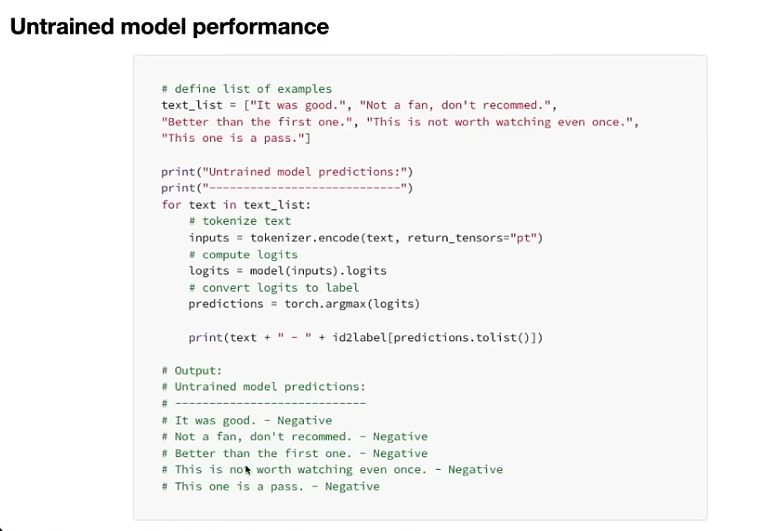

# AI Training

* QA LLM
* Automated evaluation
* Fine-tunning
* Graph RAG: **[https://www.youtube.com/watch?v=r09tJfON6kE](https://www.youtube.com/watch?v=r09tJfON6kE)**

## QA LLM

QA of LLM, or Quality Assurance of Large Language Models, refers to the process of evaluating and ensuring the quality, reliability, and performance of large language models like GPT, BERT, or other transformer-based models. As an AI engineer, understanding QA for LLMs involves several key aspects:

### Key Components of QA for LLMs:

1. **Evaluation of Model Performance**:

   - **Accuracy and Precision**: Assessing how well the model understands and generates relevant and correct responses.
   - **Benchmarking**: Using standardized datasets and metrics to compare the model's performance against other models or previous versions.
2. **Bias and Fairness**:

   - **Bias Detection**: Identifying and mitigating biases in the model’s outputs that can stem from imbalanced training data.
   - **Fairness Evaluation**: Ensuring that the model's responses are fair and non-discriminatory across different groups and scenarios.
3. **Robustness Testing**:

   - **Adversarial Testing**: Checking how the model handles edge cases, adversarial inputs, or unexpected queries.
   - **Resilience to Noise**: Testing the model’s ability to handle noisy or ambiguous input data without significant degradation in performance.
4. **Safety and Ethical Considerations**:

   - **Content Safety**: Ensuring the model does not generate harmful, offensive, or inappropriate content.
   - **Compliance**: Verifying that the model adheres to regulatory and ethical guidelines for AI use.
5. **Operational Aspects**:

   - **Latency and Scalability**: Measuring how quickly the model responds and how well it scales with increased load.
   - **Resource Utilization**: Evaluating the computational efficiency of the model.
6. **User Feedback and Iterative Improvement**:

   - **Feedback Loops**: Incorporating user feedback to continuously improve model performance.
   - **A/B Testing**: Running different versions of the model in parallel to determine which performs better in real-world scenarios.

### Tools and Techniques:

- **Automated Testing Frameworks**: Tools like Hugging Face’s `transformers` library, or custom scripts to automate the testing process.
- **Manual Evaluation**: Involving human reviewers to assess the model’s output quality in complex scenarios.
- **Performance Metrics**: Metrics such as BLEU, ROUGE, or custom metrics tailored to the specific use case of the LLM.

### Importance:

QA for LLMs is crucial for deploying AI systems that are reliable, trustworthy, and aligned with user expectations. By systematically assessing the quality of LLMs, you can ensure they deliver accurate, unbiased, and safe outputs, enhancing their utility in various applications such as chatbots, content generation, and more.

As you delve deeper into QA for LLMs, focus on understanding the specific metrics and tools relevant to your projects, and consider setting up a robust evaluation pipeline to regularly test and improve your models.

## LLM [Evaluation Metrics](https://www.confident-ai.com/blog/llm-evaluation-metrics-everything-you-need-for-llm-evaluation)


Most important common metrics:

* **Answer Relevancy:** Determines whether an LLM output is able to address the given input in an informative and concise manner.
* **Correctness:** Determines whether an LLM output is factually correct based on some ground truth.
* **Hallucination:** Determines whether an LLM output contains fake or made-up information.
* **Contextual Relevancy:** Determines whether the retriever in a RAG-based LLM system is able to extract the most relevant information for your LLM as context.
* **Responsible Metrics:** Includes metrics such as bias and toxicity, which determines whether an LLM output contains (generally) harmful and offensive content.
* **Task-Specific Metrics:** Includes metrics such as summarization, which usually contains a custom criteria depending on the use-case.

#### Different Ways to Compute Metric Scores


#### G-Eval

G-Eval is a recently developed framework from a [paper](https://arxiv.org/pdf/2303.16634.pdf) titled **“NLG Evaluation using GPT-4 with Better Human Alignment”** that **uses LLMs to evaluate LLM outputs (aka. LLM-Evals), and is one the best ways to create task-specific metrics.**

#### **SelfCheckGPT:** For hallucinations evalaution

SelfCheckGPT is an odd one. [It is a simple sampling-based approach that is used to fact-check LLM outputs.](https://arxiv.org/pdf/2303.08896.pdf) It assumes that  hallucinated outputs are not reproducible, whereas if an LLM has knowledge of a given concept, sampled responses are likely to be similar and contain consistent facts.

SelfCheckGPT is an interesting approach because it makes detecting hallucination a reference-less process, which is extremely useful in a production setting.


## DeepEval: The LLM Evaluation Framework

* Link [here](https://github.com/confident-ai/deepeval)

**DeepEval** is a simple-to-use, open-source LLM evaluation framework. It is similar to Pytest but specialized for unit testing LLM outputs. DeepEval incorporates the latest research to evaluate LLM outputs based on metrics such as G-Eval, hallucination, answer relevancy, RAGAS, etc., which uses LLMs and various other NLP models that runs **locally on your machine** for evaluation.

Whether your application is implemented via RAG or fine-tuning, LangChain or LlamaIndex, DeepEval has you covered. With it, you can easily determine the optimal hyperparameters to improve your RAG pipeline, prevent prompt drifting, or even transition from OpenAI to hosting your own Llama2 with confidence.

## Top Ranked Evaluation Frameworks

Interesting article to read: [here](https://www.superannotate.com/blog/llm-evaluation-guide#what-is-llm-evaluation)


## Interesting Links:

* AI Show: On Demand | LLM Evaluations in Azure AI Studio: [link](https://www.youtube.com/watch?v=VOQT0LAloNg)
* Azure AI Studio: Evaluation of generative AI applications:
  * [link](https://learn.microsoft.com/en-gb/azure/ai-studio/concepts/evaluation-approach-gen-ai) 1
  * [link 2](https://learn.microsoft.com/en-gb/azure/ai-studio/how-to/evaluate-generative-ai-app?pivots=ai-studio)
  * [link 3](https://azure.microsoft.com/en-us/blog/infuse-responsible-ai-tools-and-practices-in-your-llmops/)
* GraphRAG: The Marriage of Knowledge Graphs and RAG: Emil Eifrem: [link](https://www.youtube.com/watch?v=knDDGYHnnSI)
* GraphRAG: Unlocking LLM discovery on narrative private data: [link](https://www.microsoft.com/en-us/research/blog/graphrag-unlocking-llm-discovery-on-narrative-private-data/)
* End-to-End Implementation of GraphRAG(Knowledge Graphs + Retrieval Augmented Generation): [link](https://medium.com/@vinodkumargr/graphrag-graphs-retreival-augmented-generation-unlocking-llm-discovery-on-narrative-private-1bf977dadcdd)

# LLM Fine-tuning

**Topics:**

* **Instruct fine tuning (IFT)**
* Multilingual IFT
* **LoRA (Low Rank Adaptations)**
* QLoRA (Quantized)
* **Direct Preference Optimization (DPO)**
* Distributed Training
* Synthetic Data Generation

## Why Fine-tune?

* [Fine-tuning LLMs](https://www.youtube.com/watch?v=eC6Hd1hFvos&t=32s) | w/ Example Code
* A smaller (fine-tuned) model can outperform a larger base model (at particular use cases)
* Demonstrated by OpenAI when InstructGPT (1.3B) outperformed GPT-3 (175 B)

## 3 Ways to Fine-tune

1) **Self-supervised**

* Generate a curated training corpus with sequences of text. E.g. "Listen to your" + "heart" (completion)
* You can curate your training corpus to align with a certain application or format. Generate completions with a given style

2. **Supervised**

* Training set of Inputs + Outputs (Question, answer pairs)
* Recommended to use Prompt Templates:

```
""" Please answer the followinng question.
Q: {Question}
A: {Answer} """
```

3. **Reinforcement Learning**
   * Typical steps:
     1. Supervised FT
     2. Train Reward Model
     3. RF with PPO (Proximal Policy Optimization): Take the prompt, pass it to the supervised fine-tuned model, and pass the completion to the Reward Model, which will give feedback to the fine-tuned model
   * We also finde **RLHF (Reinforcement learning from human feedback),** which aimss to improve abstract qualities like helpfulness and honesty

### Supervised Fine-Tuning (in 5 Steps)

1. Choose fine-tuninng task
2. Prepare training dataset
   * E.g. Text summarization
3. Choose a base model
4. Fine-tune model via supervised learning
5. Evaluate model performance

### Fine-tune model via supervised learning *(step 4)*

**3 Options for Parameter Training:**

1. **Retrain all parameters:**
   * Probably too expensive (pre-training needss around 3 trillion tokens...)
2. **Transfer Learning**
   * Freeze subset of parameters and fine-tune only the last layers. Cheaper
3. **Parameter Efficient Fine-tuning (PEFT)**
   1. Freeze ALL the weights
   2. Augment the model with additional parameters which are trainable
   3. **Use LoRA (Low-Rank Adaptation)**

### LoRA (Low-Rank Adaptation)

* Fine-tunes the model by adding new trainable parameters


1. Create dataset (1000 data points may be enough)
2. Preprocess data
   1. Tokenize (grab tokenizer for the particular base model we are fine-tuning)
   2. Define tokenization function, specific to our dataset
      1. Extract text, tokenize and truncate text
   3. We need to add pad_token. To make all tokens same input length
   4. We can use a Data Collator to be more efficient at padding our dataset
3. Define Evaluation Metrics
   1. Define evaluation function
4. Define our LoRA configuration
5. Define hyperparameters (lr, batch_size, epochs) and training arguments



## Instruct Fine-Tuning (IFT)

*Instruction tuning* is a technique for **[fine-tuning](https://www.ibm.com/topics/fine-tuning) large language models** [(LLMs)](https://www.ibm.com/topics/large-language-models) on a labeled dataset of instructional prompts and corresponding outputs. It improves model performance not only on specific tasks, but on following instructions in general, thus helping adapt pre-trained models for practical use.

> The goal of instruction tuning is to improve the ability of LLMs to respond to NLP instructions.

### Why [instruction tune](https://www.ibm.com/topics/instruction-tuning) LLMs?

* **Problem:** The utility of instruction tuning, like that of most fine-tuning techniques, lies in the fact that pre-trained LLMs are not optimized for conversations or instruction following. In a literal sense, LLMs do not  ***answer* a prompt: they only** *append text to it.* Instruction tuning helps make that appended text more useful.
* **Limitations:** Pre-training an LLM for any specific purpose (like following instructions) is impractical. Since LLMs often have billions of parameters: training these huge models from scratch entails a tremendous amount of energy, time, computational resources and training data.
* **Solution:** IFT entails **[supervised learning](https://www.ibm.com/topics/supervised-learning) on labeled ( *input, output* ) pairs.**

> What distinguishes instruction tuning from other forms of supervised fine-tuning (SFT) is that the *input* samples in an instruction dataset consist entirely of tasks that resemble requests users might make in their prompts; the *outputs* demonstrate desirable responses to those requests.

### How does instruction tuning work?

Each training sample in an instruction dataset comprises three elements:

* **An instruction:** **A natural language text** *input* that specifies a given task. For example, “*translate this sentence from English to Spanish.”*
* **Additional information:** Optional, supplementary information that provides context relevant to the task at hand. For example, an input for a reading comprehension task might include a brief passage (and then instruct the model to answer a given question about it).
* **Desired output:** **The target** *output* —response—for the given prompt, per the instructions and context provided. This will serve as a ground truth against which the model’s predictions are evaluated and optimized.

> Certain [research](https://arxiv.org/abs/2109.01652) has demonstrated that adding additional tasks to the instruction tuning dataset improved the instruction-tuned model’s performance even on novel tasks that were not represented in the instruction dataset. Therein lies the fundamental benefit of instruction tuning: a holistic improvement in the model’s ability to follow instructions in general.

**Why Instruction tuning against multi-task fine-tuning:** [here](https://www.ibm.com/topics/instruction-tuning#Instruction+tuning+vs.+multi-task+fine-tuning)

### Challenges and limitations

* The creation of high-quality instructions for use in fine-tuning.

## How to do IFT on OpenAI GPT models?

* OpenAI Fine-tuning [guide](https://platform.openai.com/docs/guides/fine-tuning)
* Fine-tuning ChatGPT with OpenAI Tutorial - [here](https://www.youtube.com/watch?v=VVKcSf6r3CM)

At a high level, fine-tuning involves the following steps:

1. Prepare and upload training data
2. Train a new fine-tuned model
3. Evaluate results and go back to step 1 if needed
4. Use your fine-tuned model

Some common use cases where fine-tuning can improve results:

* Setting the style, tone, format, or other qualitative aspects
* Improving reliability at producing a desired output
* Correcting failures to follow complex prompts
* Handling many edge cases in specific ways
* Performing a new skill or task that’s hard to articulate in a prompt

**How to prepare the dataset:** [here](https://platform.openai.com/docs/guides/fine-tuning/preparing-your-dataset)

#### **Example count [recommendations](https://platform.openai.com/docs/guides/fine-tuning/example-count-recommendations)**

> To fine-tune a model, you are required to provide at least 10 examples. We typically see clear improvements from fine-tuning on 50 to 100 training examples with **`gpt-4o-mini` and** `gpt-3.5-turbo`, but the right number varies greatly based on the exact use case.

> We recommend starting with 50 well-crafted demonstrations and seeing if the model shows signs of improvement after fine-tuning. In some cases that may be sufficient, but even if the model is not yet production quality, clear improvements are a good sign that providing more data will continue to improve the model. No improvement suggests that you may need to rethink how to set up the task for the model or restructure the data before scaling beyond a limited example set.

#### Iterating on data [quantity](https://platform.openai.com/docs/guides/fine-tuning/iterating-on-data-quantity)

Once you’re satisfied with the quality and distribution of the examples, you can consider scaling up the number of training examples. This tends to help the model learn the task better, especially around possible "edge cases". We expect a similar amount of improvement every time you double the number of training examples. You can loosely estimate the expected quality gain from increasing the training data size by:

* Fine-tuning on your current dataset
* Fine-tuning on half of your current dataset
* Observing the quality gap between the two

In general, if you have to make a trade-off, a smaller amount of high-quality data is generally more effective than a larger amount of low-quality data.
